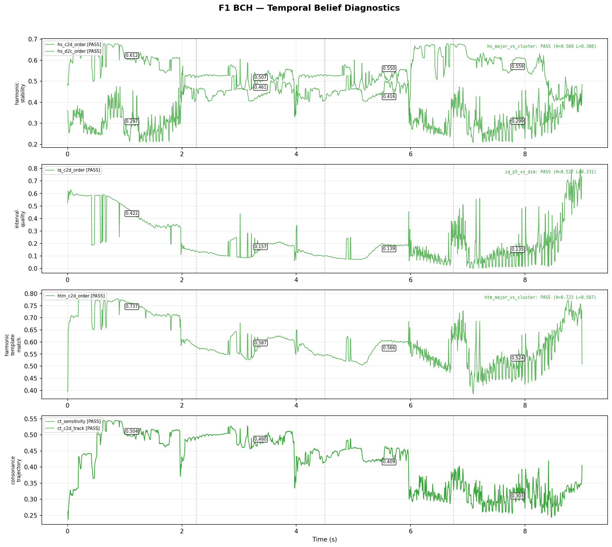
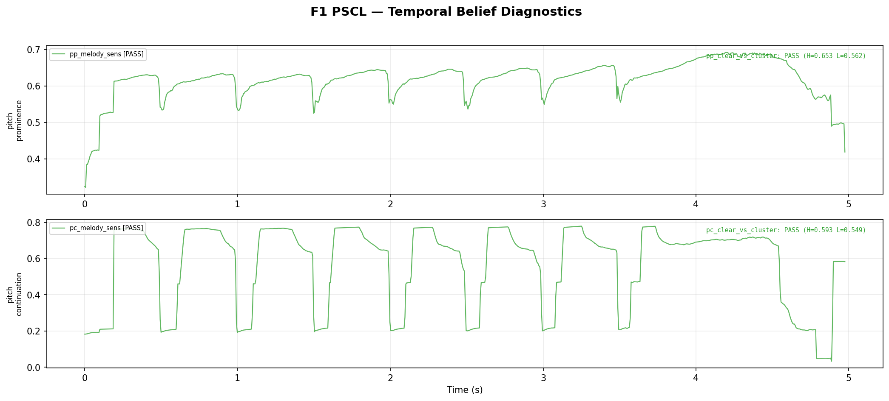
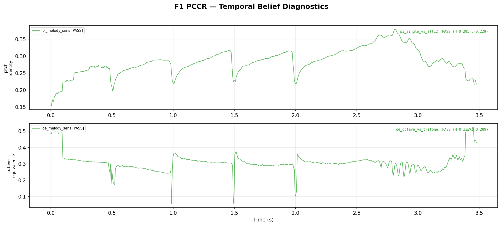
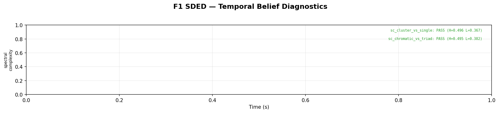
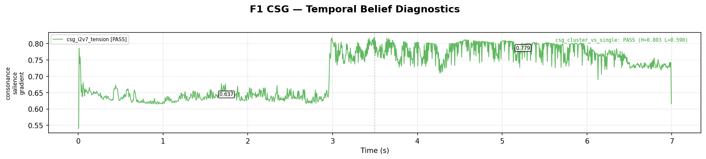
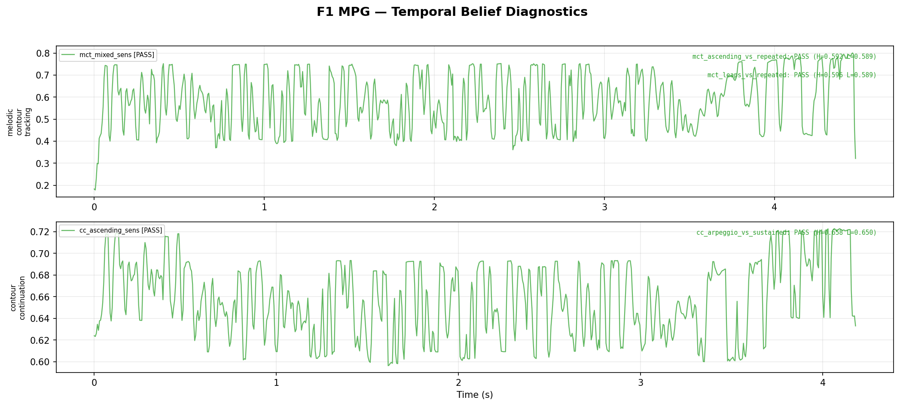
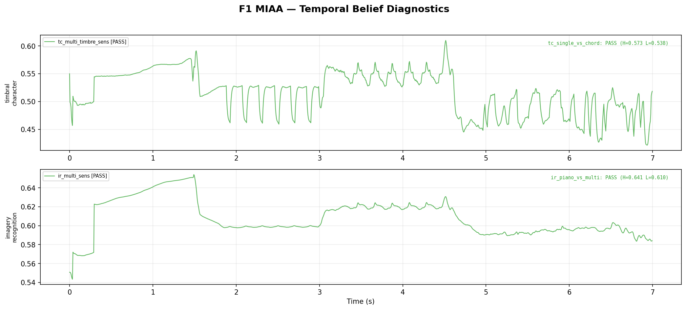
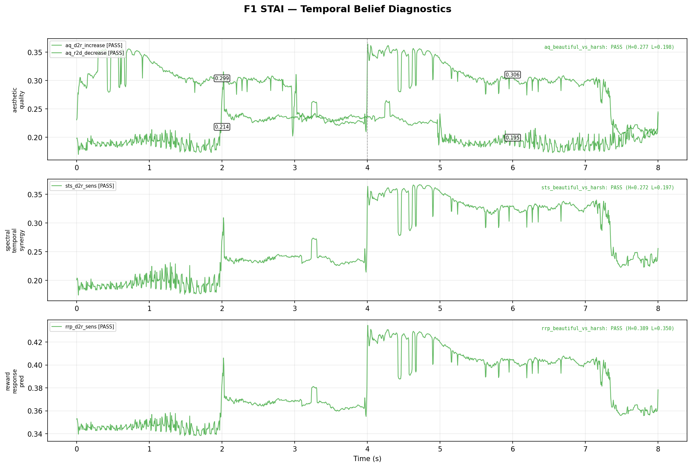
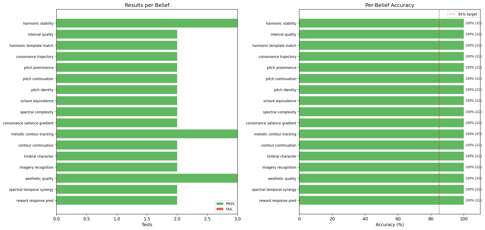

# F1 Temporal Belief Diagnostics Report

**Date**: 2026-02-27 01:20
**Total tests**: 37
**Passed**: 37 (100.0%)
**Failed**: 0
**Target**: 85%
**Status**: PASS

---

## Summary by Belief

| Belief | Relay | Tests | Pass | Fail | Accuracy |
|--------|-------|-------|------|------|----------|
| harmonic_stability | BCH | 3 | 3 | 0 | 100% + |
| interval_quality | BCH | 2 | 2 | 0 | 100% + |
| harmonic_template_match | BCH | 2 | 2 | 0 | 100% + |
| consonance_trajectory | BCH | 2 | 2 | 0 | 100% + |
| pitch_prominence | PSCL | 2 | 2 | 0 | 100% + |
| pitch_continuation | PSCL | 2 | 2 | 0 | 100% + |
| pitch_identity | PCCR | 2 | 2 | 0 | 100% + |
| octave_equivalence | PCCR | 2 | 2 | 0 | 100% + |
| spectral_complexity | SDED | 2 | 2 | 0 | 100% + |
| consonance_salience_gradient | CSG | 2 | 2 | 0 | 100% + |
| melodic_contour_tracking | MPG | 3 | 3 | 0 | 100% + |
| contour_continuation | MPG | 2 | 2 | 0 | 100% + |
| timbral_character | MIAA | 2 | 2 | 0 | 100% + |
| imagery_recognition | MIAA | 2 | 2 | 0 | 100% + |
| aesthetic_quality | STAI | 3 | 3 | 0 | 100% + |
| spectral_temporal_synergy | STAI | 2 | 2 | 0 | 100% + |
| reward_response_pred | STAI | 2 | 2 | 0 | 100% + |

---

## Detailed Results

### BCH

**+ hs_c2d_order** (ordering_decrease) — *harmonic_stability*
  Major->Minor->Dim->Cluster: stability decreases
- Expected: decrease: all 3 pairs
- Actual: 3/3 OK  means=[0.6119, 0.5072, 0.4158, 0.2990]
- Segments: [0.6119, 0.5072, 0.4158, 0.2990]

**+ hs_d2c_order** (ordering_increase) — *harmonic_stability*
  Cluster->Dim->Minor->Major: stability increases
- Expected: increase: all 3 pairs
- Actual: 3/3 OK  means=[0.2969, 0.4605, 0.5498, 0.5592]
- Segments: [0.2969, 0.4605, 0.5498, 0.5592]

**+ hs_major_vs_cluster** (comparison) — *harmonic_stability*
  Major triad > 4-note cluster
- Expected: high > low (margin 0.003)
- Actual: high=0.5691  low=0.3078  diff=+0.2613
- Segments: [0.5691, 0.3078]

**+ iq_c2d_order** (ordering_decrease) — *interval_quality*
  Pure intervals degrade through transition
- Expected: decrease: all 3 pairs
- Actual: 3/3 OK  means=[0.4218, 0.1572, 0.1395, 0.1349]
- Segments: [0.4218, 0.1572, 0.1395, 0.1349]

**+ iq_p5_vs_dim** (comparison) — *interval_quality*
  Perfect 5th > diminished triad
- Expected: high > low (margin 0.003)
- Actual: high=0.5269  low=0.2313  diff=+0.2956
- Segments: [0.5269, 0.2313]

**+ htm_c2d_order** (ordering_decrease) — *harmonic_template_match*
  Template match decreases with dissonance
- Expected: decrease: all 3 pairs
- Actual: 3/3 OK  means=[0.7370, 0.5868, 0.5656, 0.5242]
- Segments: [0.7370, 0.5868, 0.5656, 0.5242]

**+ htm_major_vs_cluster** (comparison) — *harmonic_template_match*
  Major triad matches templates > 6-note cluster
- Expected: high > low (margin 0.003)
- Actual: high=0.7229  low=0.5074  diff=+0.2155
- Segments: [0.7229, 0.5074]

**+ ct_sensitivity** (sensitivity) — *consonance_trajectory*
  Prediction should vary during consonance change
- Expected: std > 0.0030
- Actual: mean=0.4179  std=0.0839
- Segments: [0.4179, 0.0839]

**+ ct_c2d_track** (ordering_decrease) — *consonance_trajectory*
  Predicted consonance decreases (loose margin)
- Expected: decrease: all 3 pairs
- Actual: 3/3 OK  means=[0.5040, 0.4798, 0.4088, 0.3032]
- Segments: [0.5040, 0.4798, 0.4088, 0.3032]

### PSCL

**+ pp_clear_vs_cluster** (comparison) — *pitch_prominence*
  Clear single pitch > 6-note cluster
- Expected: high > low (margin 0.003)
- Actual: high=0.6528  low=0.5616  diff=+0.0911
- Segments: [0.6528, 0.5616]

**+ pp_melody_sens** (sensitivity) — *pitch_prominence*
  Pitch prominence varies during melody
- Expected: std > 0.0030
- Actual: mean=0.6255  std=0.0384
- Segments: [0.6255, 0.0384]

**+ pc_clear_vs_cluster** (comparison) — *pitch_continuation*
  Clear pitch = confident continuation > cluster
- Expected: high > low (margin 0.003)
- Actual: high=0.5928  low=0.5493  diff=+0.0435
- Segments: [0.5928, 0.5493]

**+ pc_melody_sens** (sensitivity) — *pitch_continuation*
  Pitch prediction varies during melody
- Expected: std > 0.0030
- Actual: mean=0.5840  std=0.2167
- Segments: [0.5840, 0.2167]

### PCCR

**+ pi_single_vs_all12** (comparison) — *pitch_identity*
  Single pitch identity > all-12 chromatic
- Expected: high > low (margin 0.003)
- Actual: high=0.2953  low=0.2292  diff=+0.0661
- Segments: [0.2953, 0.2292]

**+ pi_melody_sens** (sensitivity) — *pitch_identity*
  Pitch identity varies during melody
- Expected: std > 0.0030
- Actual: mean=0.2879  std=0.0342
- Segments: [0.2879, 0.0342]

**+ oe_octave_vs_tritone** (comparison) — *octave_equivalence*
  Octave dyad (same chroma) > tritone dyad
- Expected: high > low (margin 0.003)
- Actual: high=0.3296  low=0.2893  diff=+0.0403
- Segments: [0.3296, 0.2893]

**+ oe_melody_sens** (sensitivity) — *octave_equivalence*
  Octave equivalence varies with pitch changes
- Expected: std > 0.0030
- Actual: mean=0.3016  std=0.0480
- Segments: [0.3016, 0.0480]

### SDED

**+ sc_cluster_vs_single** (comparison) — *spectral_complexity*
  6-note cluster more complex than single note
- Expected: high > low (margin 0.003)
- Actual: high=0.4960  low=0.3672  diff=+0.1288
- Segments: [0.4960, 0.3672]

**+ sc_chromatic_vs_triad** (comparison) — *spectral_complexity*
  Full chromatic more complex than major triad
- Expected: high > low (margin 0.003)
- Actual: high=0.4946  low=0.3816  diff=+0.1131
- Segments: [0.4946, 0.3816]

### CSG

**+ csg_cluster_vs_single** (comparison) — *consonance_salience_gradient*
  Cluster has higher salience than single note
- Expected: high > low (margin 0.003)
- Actual: high=0.8033  low=0.5897  diff=+0.2137
- Segments: [0.8033, 0.5897]

**+ csg_i2v7_tension** (ordering_increase) — *consonance_salience_gradient*
  Moving to V7 increases consonance salience
- Expected: increase: all 1 pairs
- Actual: 1/1 OK  means=[0.6369, 0.7790]
- Segments: [0.6369, 0.7790]

### MPG

**+ mct_ascending_vs_repeated** (comparison) — *melodic_contour_tracking*
  Active melody with pitch changes > repeated single note
- Expected: high > low (margin 0.003)
- Actual: high=0.5920  low=0.5885  diff=+0.0035
- Segments: [0.5920, 0.5885]

**+ mct_leaps_vs_repeated** (comparison) — *melodic_contour_tracking*
  Octave leaps (large contour) > repeated note (flat contour)
- Expected: high > low (margin 0.003)
- Actual: high=0.5958  low=0.5885  diff=+0.0073
- Segments: [0.5958, 0.5885]

**+ mct_mixed_sens** (sensitivity) — *melodic_contour_tracking*
  Contour tracking varies with direction changes
- Expected: std > 0.0030
- Actual: mean=0.5882  std=0.1239
- Segments: [0.5882, 0.1239]

**+ cc_arpeggio_vs_sustained** (comparison) — *contour_continuation*
  Active contour = confident prediction > sustained
- Expected: high > low (margin 0.003)
- Actual: high=0.6575  low=0.6501  diff=+0.0074
- Segments: [0.6575, 0.6501]

**+ cc_ascending_sens** (sensitivity) — *contour_continuation*
  Contour prediction varies during melody
- Expected: std > 0.0030
- Actual: mean=0.6564  std=0.0338
- Segments: [0.6564, 0.0338]

### MIAA

**+ tc_single_vs_chord** (comparison) — *timbral_character*
  Single note = clearer timbral identity > chord
- Expected: high > low (margin 0.003)
- Actual: high=0.5727  low=0.5378  diff=+0.0349
- Segments: [0.5727, 0.5378]

**+ tc_multi_timbre_sens** (sensitivity) — *timbral_character*
  Timbral character varies across instruments
- Expected: std > 0.0030
- Actual: mean=0.5171  std=0.0386
- Segments: [0.5171, 0.0386]

**+ ir_piano_vs_multi** (comparison) — *imagery_recognition*
  Stable timbre more predictable than changing
- Expected: high > low (margin 0.003)
- Actual: high=0.6413  low=0.6097  diff=+0.0316
- Segments: [0.6413, 0.6097]

**+ ir_multi_sens** (sensitivity) — *imagery_recognition*
  Imagery prediction varies with timbre changes
- Expected: std > 0.0030
- Actual: mean=0.6097  std=0.0173
- Segments: [0.6097, 0.0173]

### STAI

**+ aq_d2r_increase** (ordering_increase) — *aesthetic_quality*
  Dissonant->Resolved: aesthetic quality increases
- Expected: increase: all 1 pairs
- Actual: 1/1 OK  means=[0.2138, 0.3058]
- Segments: [0.2138, 0.3058]

**+ aq_r2d_decrease** (ordering_decrease) — *aesthetic_quality*
  Resolved->Dissonant: aesthetic quality decreases
- Expected: decrease: all 1 pairs
- Actual: 1/1 OK  means=[0.2993, 0.1948]
- Segments: [0.2993, 0.1948]

**+ aq_beautiful_vs_harsh** (comparison) — *aesthetic_quality*
  Beautiful strings > harsh chromatic
- Expected: high > low (margin 0.003)
- Actual: high=0.2774  low=0.1981  diff=+0.0793
- Segments: [0.2774, 0.1981]

**+ sts_beautiful_vs_harsh** (comparison) — *spectral_temporal_synergy*
  Beautiful = high synergy > dense cluster
- Expected: high > low (margin 0.003)
- Actual: high=0.2716  low=0.1969  diff=+0.0747
- Segments: [0.2716, 0.1969]

**+ sts_d2r_sens** (sensitivity) — *spectral_temporal_synergy*
  Synergy varies during resolution transition
- Expected: std > 0.0030
- Actual: mean=0.2709  std=0.0595
- Segments: [0.2709, 0.0595]

**+ rrp_beautiful_vs_harsh** (comparison) — *reward_response_pred*
  Higher reward prediction for beautiful music
- Expected: high > low (margin 0.003)
- Actual: high=0.3885  low=0.3496  diff=+0.0389
- Segments: [0.3885, 0.3496]

**+ rrp_d2r_sens** (sensitivity) — *reward_response_pred*
  Reward prediction varies during resolution
- Expected: std > 0.0030
- Actual: mean=0.3805  std=0.0274
- Segments: [0.3805, 0.0274]

---

## Charts

