# F1 Temporal Belief Diagnostics Report

**Date:** 2026-03-02 11:08
**Pipeline:** R3 (97D) -> H3 -> C3 (131 beliefs)
**Test cases:** 16
**Total assertions:** 36 (+ 11 baseline)
**Passed:** 36/36 (100.0%)
**Elapsed:** 21.4s

> **TARGET MET: 100.0% >= 85%**

## Summary by Belief

| # | Belief | Relay | Type | Pass | Total | Accuracy | Status |
|---|--------|-------|------|------|-------|----------|--------|
| 1 | `harmonic_stability` | BCH | Core | 8 | 8 | 100% | PASS |
| 2 | `interval_quality` | BCH | Appraisal | 3 | 3 | 100% | PASS |
| 3 | `harmonic_template_match` | BCH | Appraisal | 2 | 2 | 100% | PASS |
| 4 | `consonance_trajectory` | BCH | Anticipation | 1 | 1 | 100% | PASS |
| 5 | `pitch_prominence` | PSCL | Core | 2 | 2 | 100% | PASS |
| 6 | `pitch_continuation` | PSCL | Anticipation | 1 | 1 | 100% | PASS |
| 7 | `pitch_identity` | PCCR | Core | 1 | 1 | 100% | PASS |
| 8 | `octave_equivalence` | PCCR | Appraisal | 1 | 1 | 100% | PASS |
| 9 | `spectral_complexity` | SDED | Appraisal | 6 | 6 | 100% | PASS |
| 10 | `consonance_salience_gradient` | CSG | Appraisal | 4 | 4 | 100% | PASS |
| 11 | `melodic_contour_tracking` | MPG | Appraisal | 1 | 1 | 100% | PASS |
| 12 | `contour_continuation` | MPG | Anticipation | 1 | 1 | 100% | PASS |
| 13 | `timbral_character` | MIAA | Core | 1 | 1 | 100% | PASS |
| 14 | `imagery_recognition` | MIAA | Anticipation | 1 | 1 | 100% | PASS |
| 15 | `aesthetic_quality` | STAI | Core | 3 | 3 | 100% | PASS |
| 16 | `spectral_temporal_synergy` | STAI | Appraisal | 2 | 2 | 100% | PASS |
| 17 | `reward_response_pred` | STAI | Anticipation | 2 | 2 | 100% | PASS |

## Detailed Results

### harmonic_stability (BCH / Core)

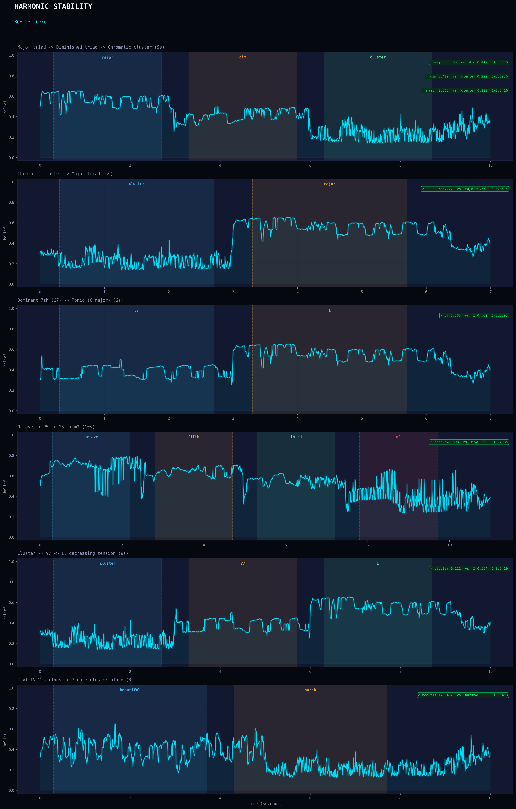

| Test | Assertion | Seg A | Val A | Seg B | Val B | Diff | Result |
|------|-----------|-------|-------|-------|-------|------|--------|
| consonance_gradient | Consonant > diminished | major | 0.5633 | dim | 0.4193 | +0.1440 | PASS |
| consonance_gradient | Diminished > cluster | dim | 0.4193 | cluster | 0.2217 | +0.1976 | PASS |
| consonance_gradient | Major > cluster (full gradient) | major | 0.5633 | cluster | 0.2217 | +0.3416 | PASS |
| dissonance_resolution | Resolution increases stability | cluster | 0.2221 | major | 0.5635 | -0.3414 | PASS |
| cadence_V7_I | Tonic more stable than dominant | V7 | 0.3826 | I | 0.5623 | -0.1797 | PASS |
| interval_quality_sweep | Octave more stable | octave | 0.6976 | m2 | 0.3991 | +0.2985 | PASS |
| tension_release | Tonic more stable than cluster | cluster | 0.2221 | I | 0.5640 | -0.3419 | PASS |
| aesthetic_gradient | Consonant progression > cluster | beautiful | 0.4019 | harsh | 0.2546 | +0.1473 | PASS |

### interval_quality (BCH / Appraisal)

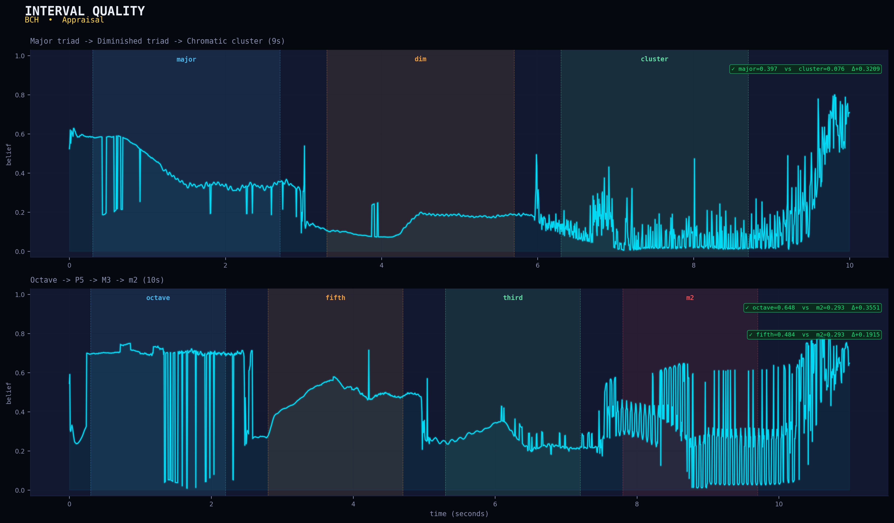

| Test | Assertion | Seg A | Val A | Seg B | Val B | Diff | Result |
|------|-----------|-------|-------|-------|-------|------|--------|
| consonance_gradient | Major intervals > cluster intervals | major | 0.3970 | cluster | 0.0762 | +0.3209 | PASS |
| interval_quality_sweep | Octave quality > minor 2nd | octave | 0.6481 | m2 | 0.2929 | +0.3551 | PASS |
| interval_quality_sweep | P5 quality > minor 2nd | fifth | 0.4845 | m2 | 0.2929 | +0.1915 | PASS |

### harmonic_template_match (BCH / Appraisal)

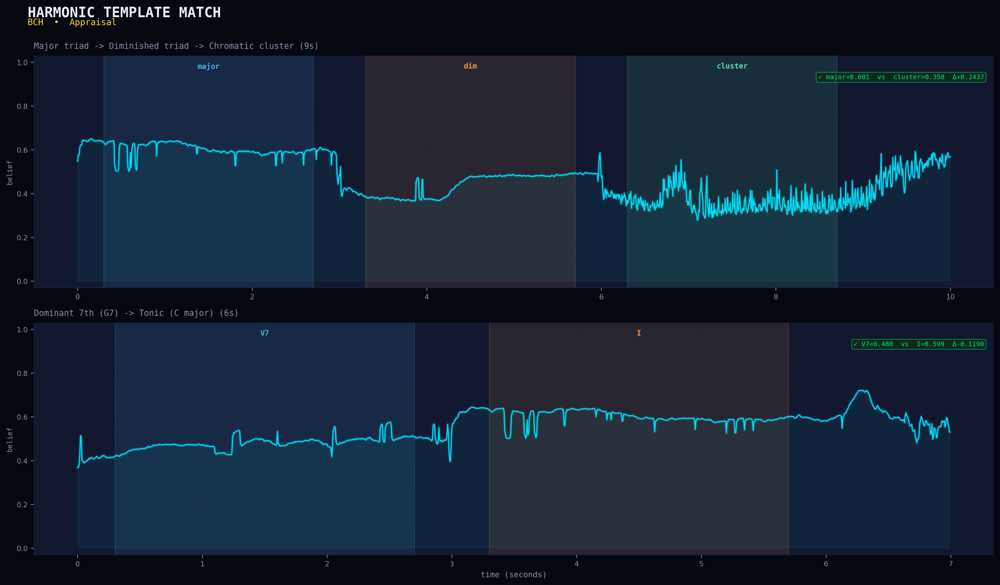

| Test | Assertion | Seg A | Val A | Seg B | Val B | Diff | Result |
|------|-----------|-------|-------|-------|-------|------|--------|
| consonance_gradient | Triad matches template > cluster | major | 0.6013 | cluster | 0.3576 | +0.2437 | PASS |
| cadence_V7_I | Tonic matches template better | V7 | 0.4802 | I | 0.5993 | -0.1190 | PASS |

### consonance_trajectory (BCH / Anticipation)

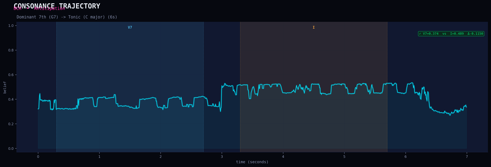

| Test | Assertion | Seg A | Val A | Seg B | Val B | Diff | Result |
|------|-----------|-------|-------|-------|-------|------|--------|
| cadence_V7_I | Forecasts resolution | V7 | 0.3739 | I | 0.4889 | -0.1150 | PASS |

### pitch_prominence (PSCL / Core)

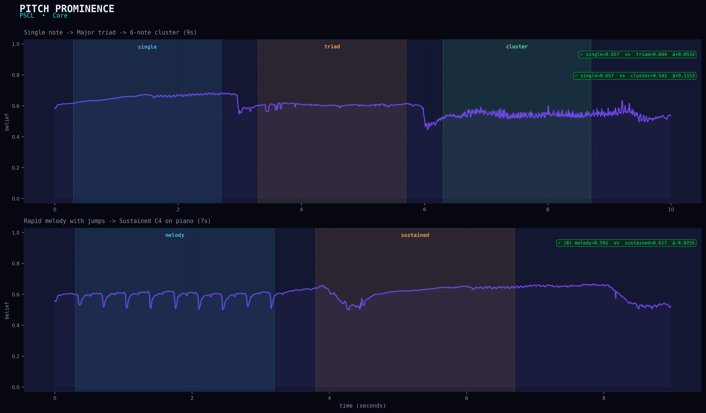

| Test | Assertion | Seg A | Val A | Seg B | Val B | Diff | Result |
|------|-----------|-------|-------|-------|-------|------|--------|
| pitch_clarity_gradient | Single note clearer pitch than chord | single | 0.6572 | triad | 0.6039 | +0.0532 | PASS |
| pitch_clarity_gradient | Single note clearer than cluster | single | 0.6572 | cluster | 0.5420 | +0.1152 | PASS |
| melody_vs_static | Both segments have pitch prominence (baseline) (baseline) | melody | 0.5913 | sustained | 0.6168 | -0.0255 | PASS |

### pitch_continuation (PSCL / Anticipation)

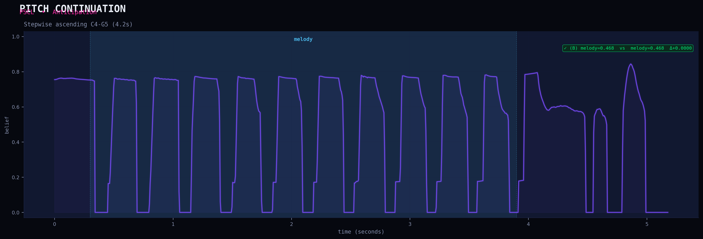

| Test | Assertion | Seg A | Val A | Seg B | Val B | Diff | Result |
|------|-----------|-------|-------|-------|-------|------|--------|
| stepwise_melody | Pitch continuation present during melody (baseline) | melody | 0.4684 | melody | 0.4684 | +0.0000 | PASS |

### pitch_identity (PCCR / Core)

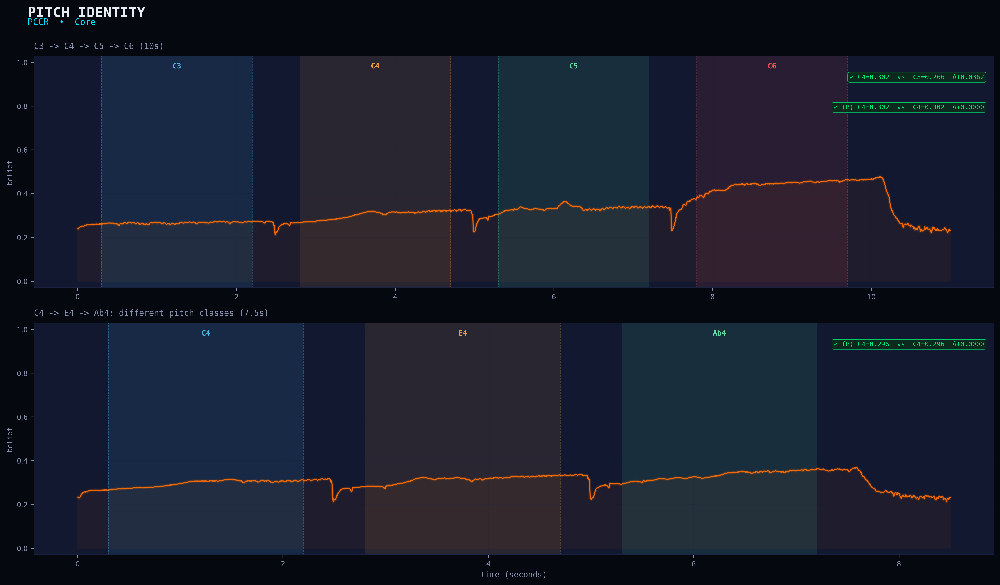

| Test | Assertion | Seg A | Val A | Seg B | Val B | Diff | Result |
|------|-----------|-------|-------|-------|-------|------|--------|
| octave_equivalence | C4 stronger pitch identity than C3 (register effect) | C4 | 0.3022 | C3 | 0.2660 | +0.0362 | PASS |
| octave_equivalence | C4 pitch identity present (baseline) (baseline) | C4 | 0.3022 | C4 | 0.3022 | +0.0000 | PASS |
| chroma_change | C4 has pitch identity (baseline) (baseline) | C4 | 0.2959 | C4 | 0.2959 | +0.0000 | PASS |

### octave_equivalence (PCCR / Appraisal)

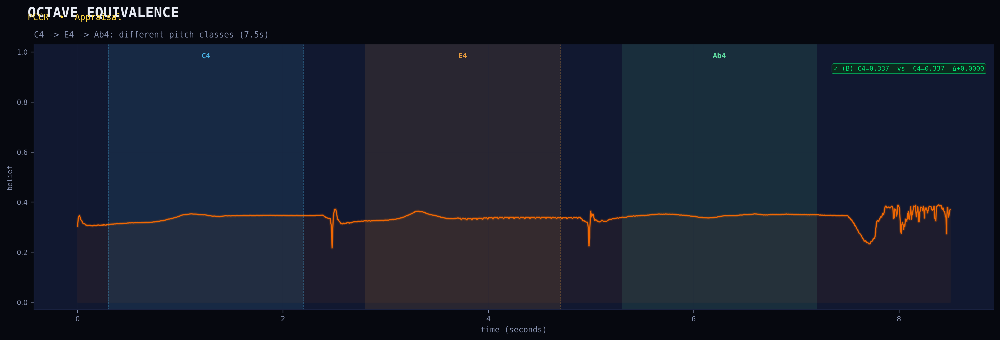

| Test | Assertion | Seg A | Val A | Seg B | Val B | Diff | Result |
|------|-----------|-------|-------|-------|-------|------|--------|
| chroma_change | Octave equiv present for single note (baseline) (baseline) | C4 | 0.3372 | C4 | 0.3372 | +0.0000 | PASS |

### spectral_complexity (SDED / Appraisal)

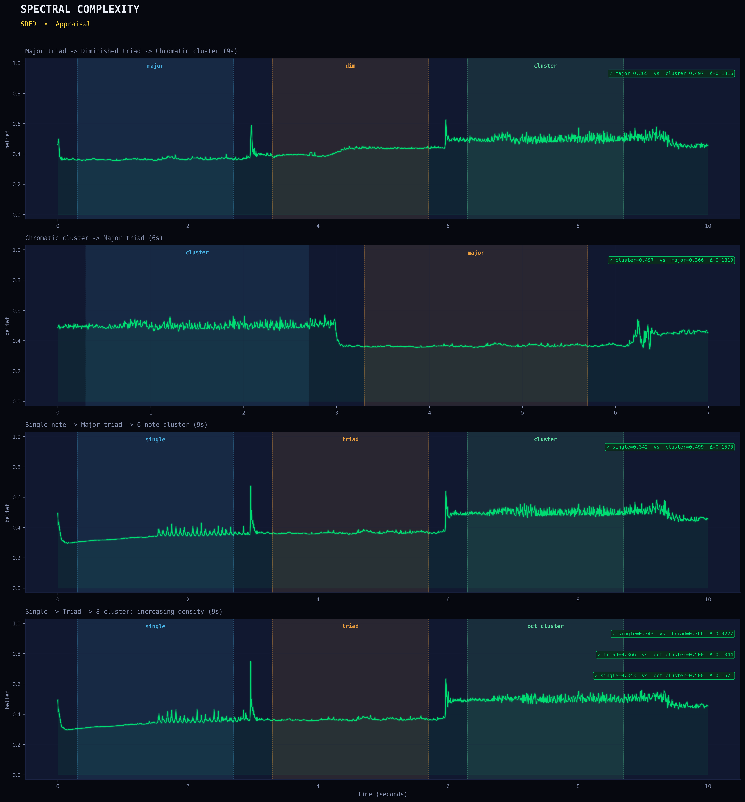

| Test | Assertion | Seg A | Val A | Seg B | Val B | Diff | Result |
|------|-----------|-------|-------|-------|-------|------|--------|
| consonance_gradient | Cluster is spectrally denser | major | 0.3655 | cluster | 0.4971 | -0.1316 | PASS |
| dissonance_resolution | Cluster is more complex | cluster | 0.4975 | major | 0.3656 | +0.1319 | PASS |
| pitch_clarity_gradient | Cluster is denser | single | 0.3418 | cluster | 0.4990 | -0.1573 | PASS |
| spectral_density | Triad denser than single | single | 0.3429 | triad | 0.3656 | -0.0227 | PASS |
| spectral_density | 8-cluster denser than triad | triad | 0.3656 | oct_cluster | 0.5000 | -0.1344 | PASS |
| spectral_density | Full density gradient | single | 0.3429 | oct_cluster | 0.5000 | -0.1571 | PASS |

### consonance_salience_gradient (CSG / Appraisal)

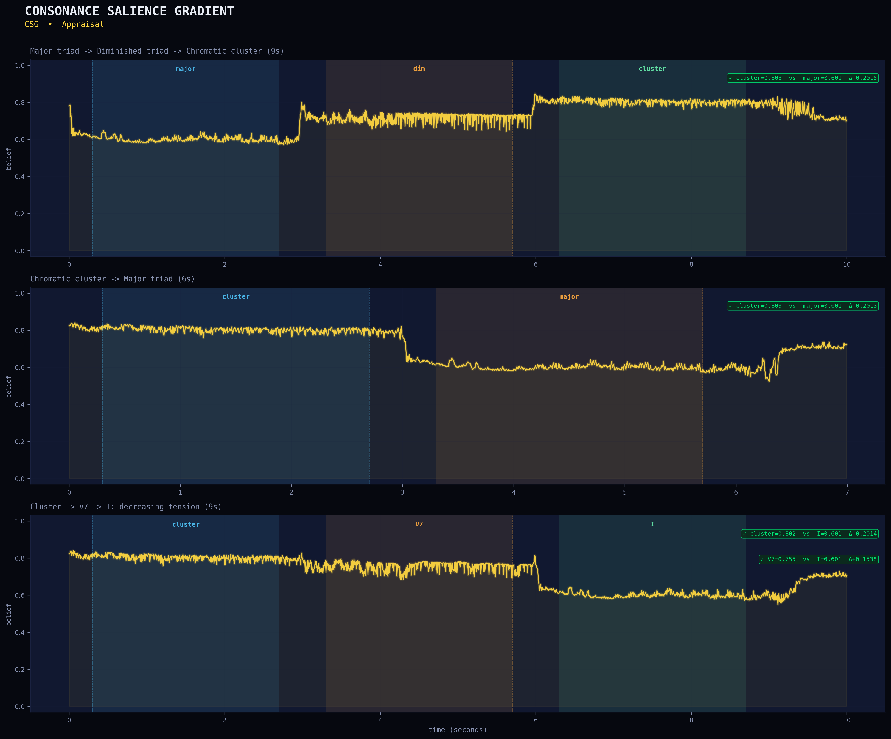

| Test | Assertion | Seg A | Val A | Seg B | Val B | Diff | Result |
|------|-----------|-------|-------|-------|-------|------|--------|
| consonance_gradient | Dissonance drives salience | cluster | 0.8029 | major | 0.6014 | +0.2015 | PASS |
| dissonance_resolution | Cluster drives more salience | cluster | 0.8027 | major | 0.6014 | +0.2013 | PASS |
| tension_release | Cluster > tonic salience | cluster | 0.8024 | I | 0.6010 | +0.2014 | PASS |
| tension_release | V7 > tonic salience | V7 | 0.7548 | I | 0.6010 | +0.1538 | PASS |

### melodic_contour_tracking (MPG / Appraisal)

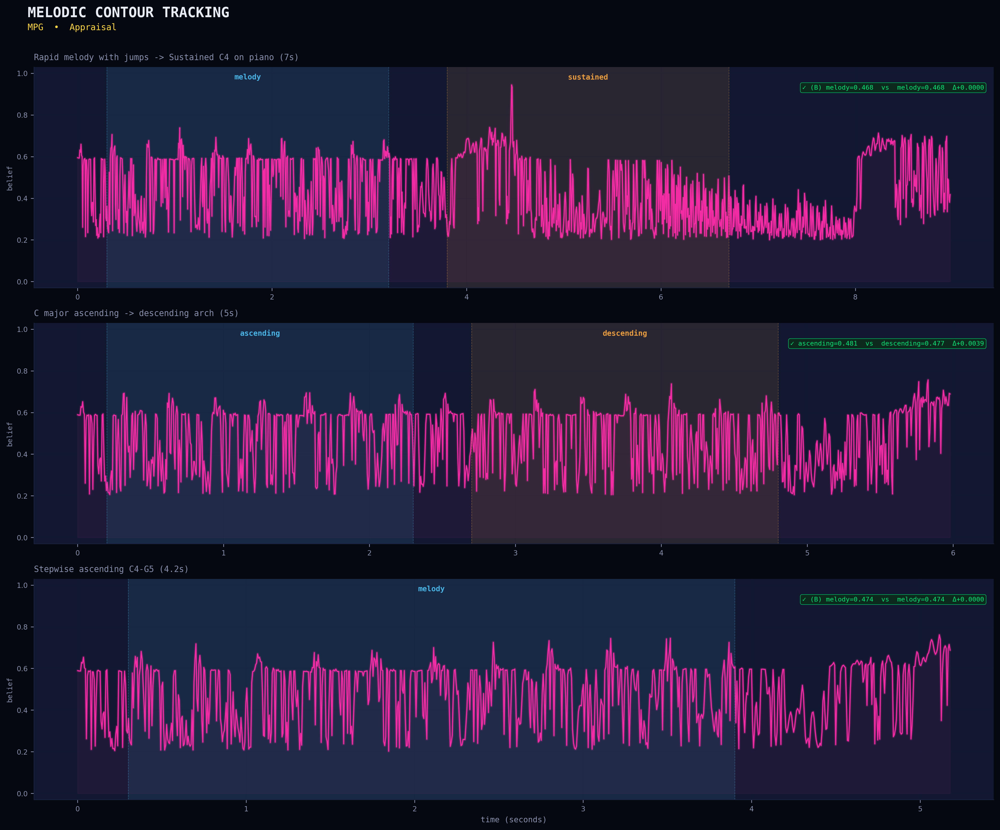

| Test | Assertion | Seg A | Val A | Seg B | Val B | Diff | Result |
|------|-----------|-------|-------|-------|-------|------|--------|
| melody_vs_static | Melody contour tracking active (baseline) (baseline) | melody | 0.4680 | melody | 0.4680 | +0.0000 | PASS |
| ascending_descending | Both segments have contour (ascending may be higher) | ascending | 0.4806 | descending | 0.4767 | +0.0039 | PASS |
| stepwise_melody | Contour tracking active during melody (baseline) | melody | 0.4737 | melody | 0.4737 | +0.0000 | PASS |

### contour_continuation (MPG / Anticipation)

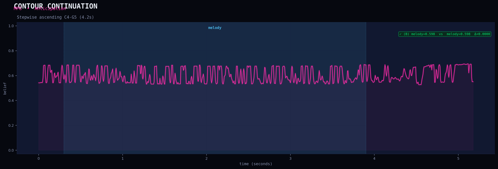

| Test | Assertion | Seg A | Val A | Seg B | Val B | Diff | Result |
|------|-----------|-------|-------|-------|-------|------|--------|
| stepwise_melody | Contour continuation during stepwise motion (baseline) | melody | 0.5980 | melody | 0.5980 | +0.0000 | PASS |

### timbral_character (MIAA / Core)

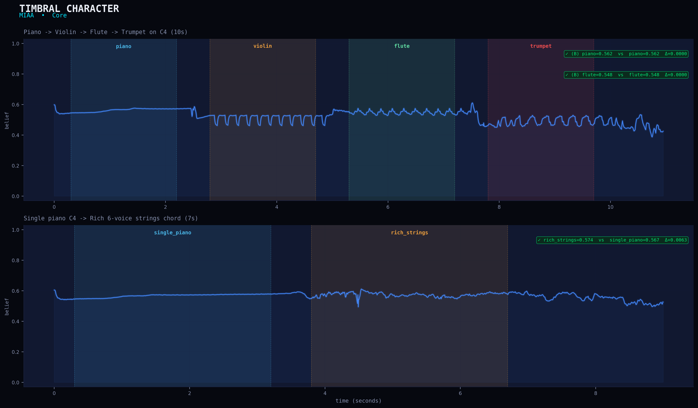

| Test | Assertion | Seg A | Val A | Seg B | Val B | Diff | Result |
|------|-----------|-------|-------|-------|-------|------|--------|
| timbre_sequence | Piano has timbral character (baseline) (baseline) | piano | 0.5624 | piano | 0.5624 | +0.0000 | PASS |
| timbre_sequence | Flute has timbral character (baseline) (baseline) | flute | 0.5476 | flute | 0.5476 | +0.0000 | PASS |
| timbre_contrast | Rich strings chord > single piano note timbral char | rich_strings | 0.5736 | single_piano | 0.5673 | +0.0063 | PASS |

### imagery_recognition (MIAA / Anticipation)

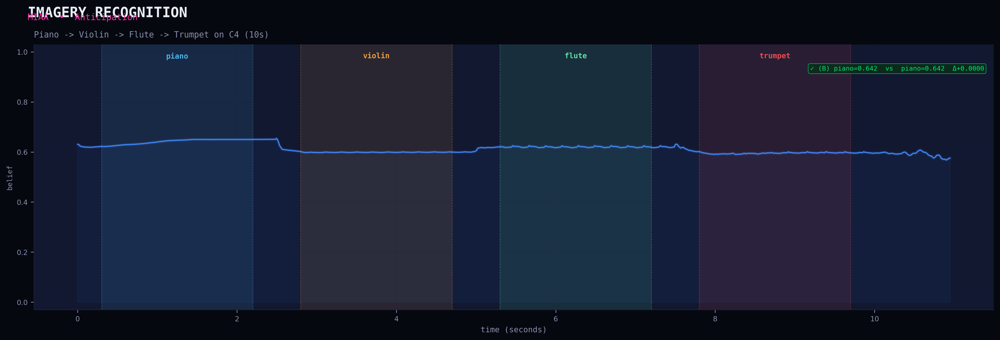

| Test | Assertion | Seg A | Val A | Seg B | Val B | Diff | Result |
|------|-----------|-------|-------|-------|-------|------|--------|
| timbre_sequence | Piano imagery recognition (baseline) (baseline) | piano | 0.6416 | piano | 0.6416 | +0.0000 | PASS |

### aesthetic_quality (STAI / Core)

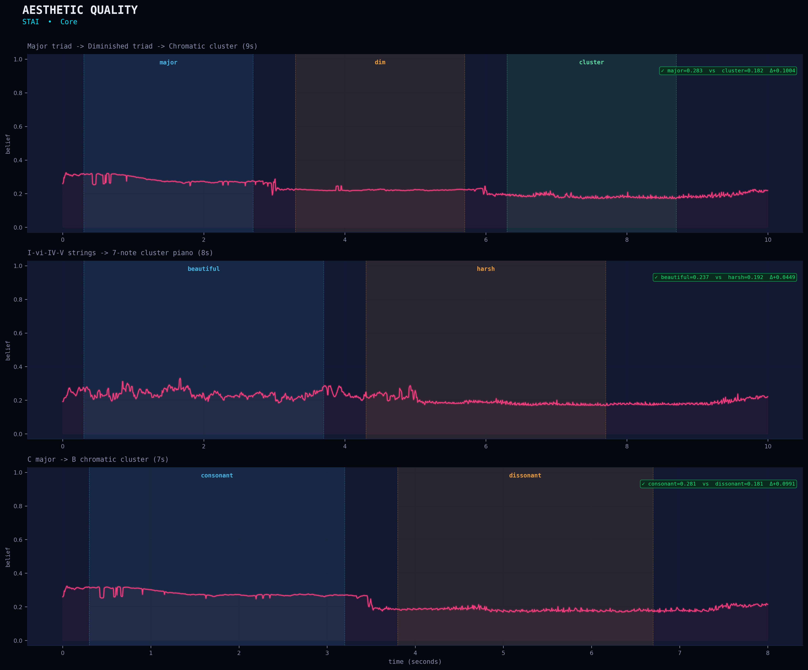

| Test | Assertion | Seg A | Val A | Seg B | Val B | Diff | Result |
|------|-----------|-------|-------|-------|-------|------|--------|
| consonance_gradient | Consonant = more aesthetic | major | 0.2828 | cluster | 0.1824 | +0.1004 | PASS |
| aesthetic_gradient | Beautiful progression > harsh cluster | beautiful | 0.2370 | harsh | 0.1920 | +0.0449 | PASS |
| aesthetic_surprise | Consonance > dissonance aesthetically | consonant | 0.2806 | dissonant | 0.1814 | +0.0991 | PASS |

### spectral_temporal_synergy (STAI / Appraisal)

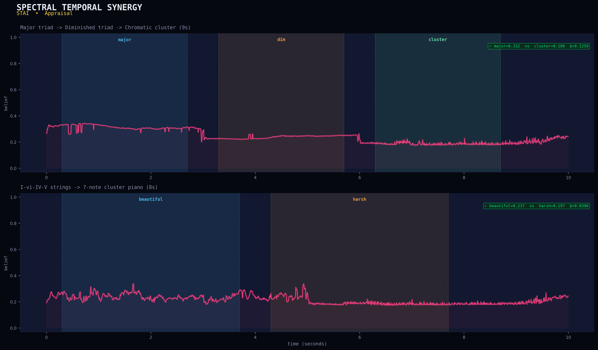

| Test | Assertion | Seg A | Val A | Seg B | Val B | Diff | Result |
|------|-----------|-------|-------|-------|-------|------|--------|
| consonance_gradient | Consonant = higher synergy | major | 0.3119 | cluster | 0.1860 | +0.1259 | PASS |
| aesthetic_gradient | Consonant flow > static cluster | beautiful | 0.2369 | harsh | 0.1974 | +0.0396 | PASS |

### reward_response_pred (STAI / Anticipation)

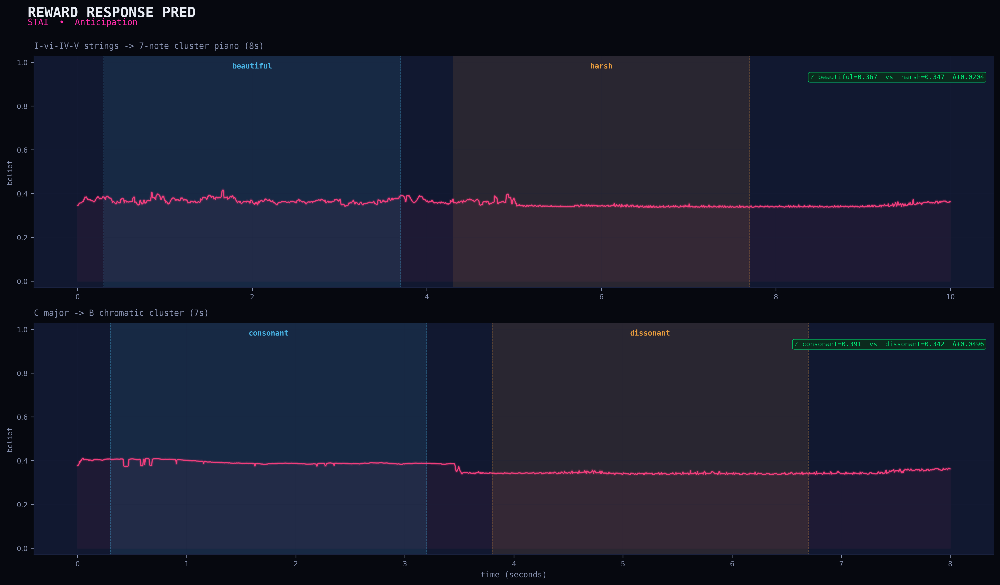

| Test | Assertion | Seg A | Val A | Seg B | Val B | Diff | Result |
|------|-----------|-------|-------|-------|-------|------|--------|
| aesthetic_gradient | Beautiful predicts more reward | beautiful | 0.3672 | harsh | 0.3469 | +0.0204 | PASS |
| aesthetic_surprise | Consonant predicts reward > dissonant | consonant | 0.3913 | dissonant | 0.3417 | +0.0496 | PASS |

## Test Audio Stimuli

| # | Test Case | Description | Duration |
|---|-----------|-------------|----------|
| 1 | `consonance_gradient` | Major triad -> Diminished triad -> Chromatic cluster (9s) | 10.0s |
| 2 | `dissonance_resolution` | Chromatic cluster -> Major triad (6s) | 7.0s |
| 3 | `cadence_V7_I` | Dominant 7th (G7) -> Tonic (C major) (6s) | 7.0s |
| 4 | `interval_quality_sweep` | Octave -> P5 -> M3 -> m2 (10s) | 11.0s |
| 5 | `pitch_clarity_gradient` | Single note -> Major triad -> 6-note cluster (9s) | 10.0s |
| 6 | `octave_equivalence` | C3 -> C4 -> C5 -> C6 (10s) | 11.0s |
| 7 | `chroma_change` | C4 -> E4 -> Ab4: different pitch classes (7.5s) | 8.5s |
| 8 | `spectral_density` | Single -> Triad -> 8-cluster: increasing density (9s) | 10.0s |
| 9 | `tension_release` | Cluster -> V7 -> I: decreasing tension (9s) | 10.0s |
| 10 | `melody_vs_static` | Rapid melody with jumps -> Sustained C4 on piano (7s) | 9.0s |
| 11 | `ascending_descending` | C major ascending -> descending arch (5s) | 6.0s |
| 12 | `stepwise_melody` | Stepwise ascending C4-G5 (4.2s) | 5.2s |
| 13 | `timbre_sequence` | Piano -> Violin -> Flute -> Trumpet on C4 (10s) | 10.9s |
| 14 | `timbre_contrast` | Single piano C4 -> Rich 6-voice strings chord (7s) | 9.0s |
| 15 | `aesthetic_gradient` | I-vi-IV-V strings -> 7-note cluster piano (8s) | 10.0s |
| 16 | `aesthetic_surprise` | C major -> B chromatic cluster (7s) | 8.0s |
